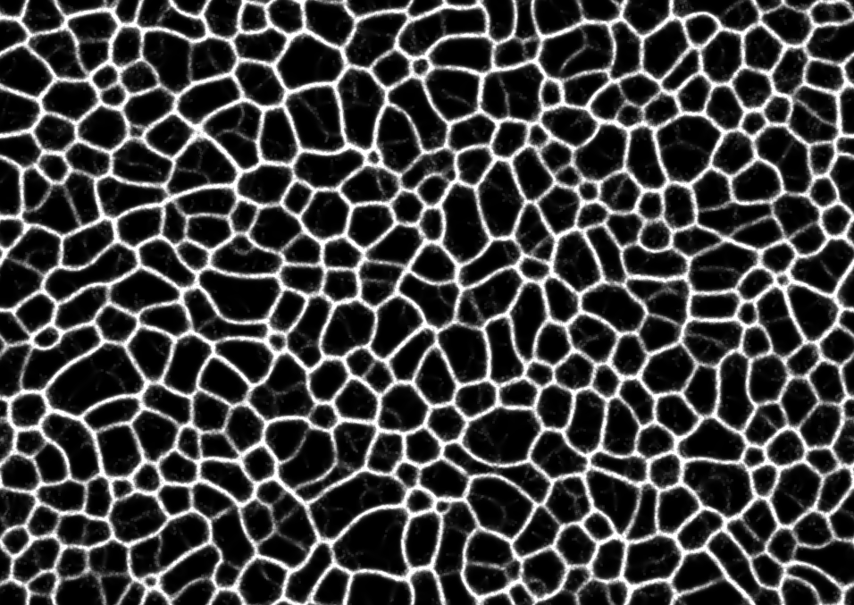
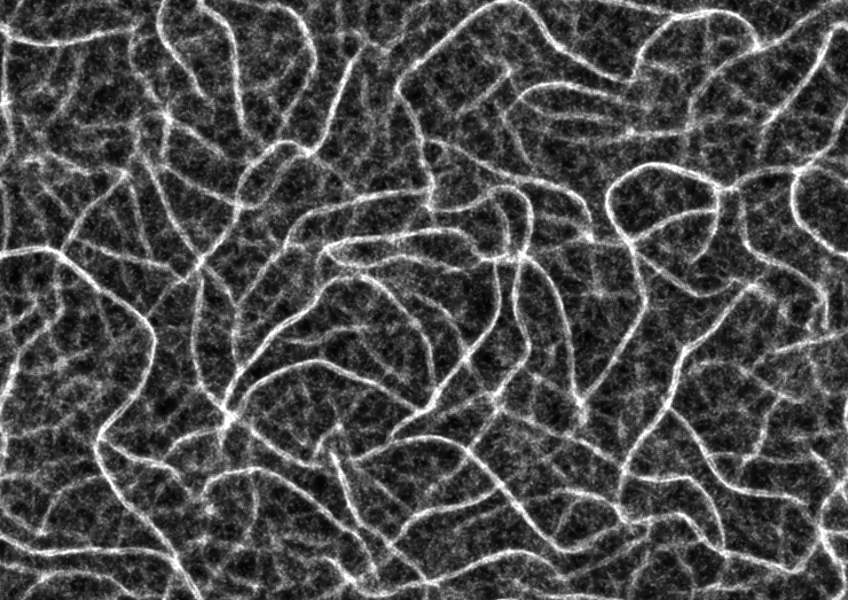
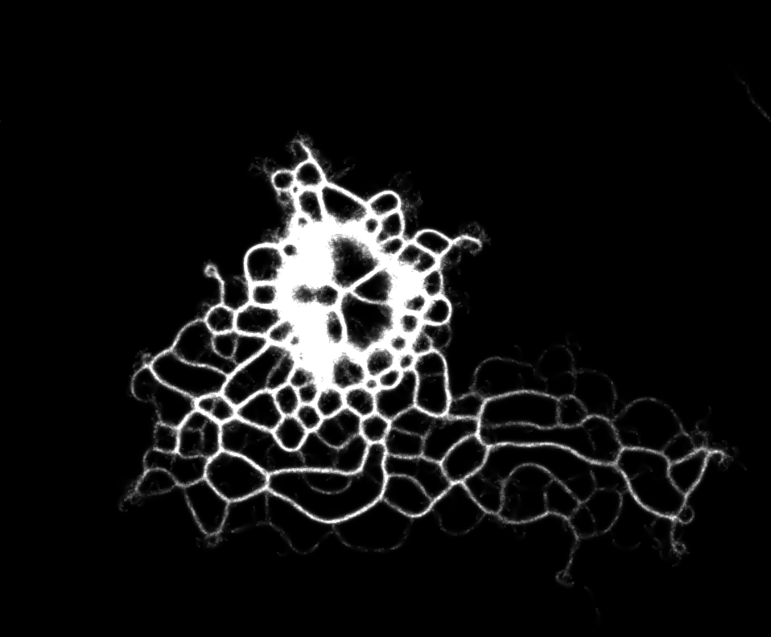
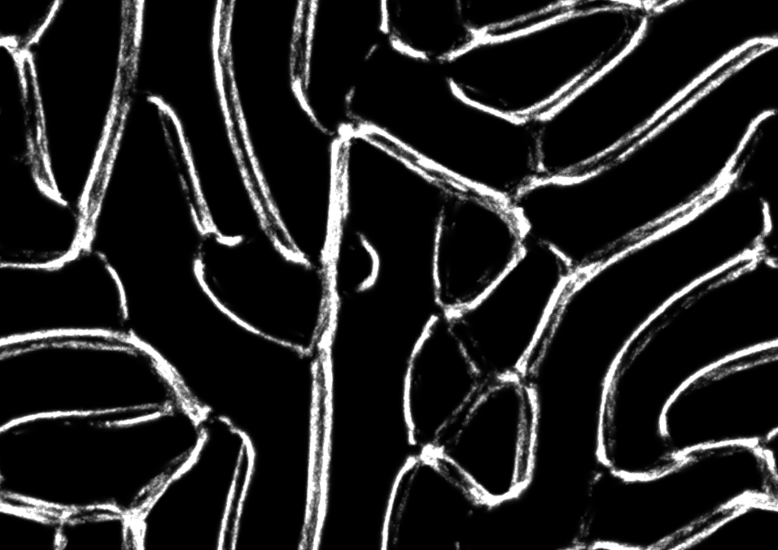
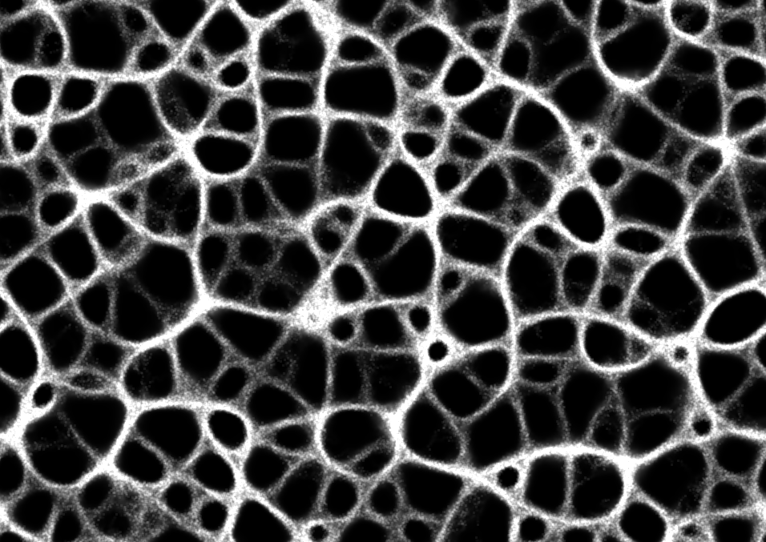

# Physarum Simulation

A simple slime mold inspired simulation based on the behavior of **Physarum Polycephalum**.

Inspired by Sage Jenson's article and implemented using only **HTML, CSS, and JavaScript**.

The simulation uses thousands of autonomous agents that move, sense, deposit trails, and collectively form evolving organic patterns.

---

# ✨ Features

- Pure HTML, CSS, and JavaScript
- Real-time Physarum / slime mold simulation
- Thousands of autonomous agents
- Trail diffusion and decay system
- Adjustable simulation parameters
- Canvas-based rendering
- Procedural emergent pattern generation

---

# 🧠 Technical Overview

The simulation is rendered using the HTML5 Canvas API and powered entirely by vanilla JavaScript.

Each agent follows a simple behavior system:

- Sense nearby trail intensity
- Rotate toward stronger signals
- Move forward
- Deposit trail particles
- Contribute to diffusion and decay updates

Although each agent follows simple rules individually, their combined behavior produces complex organic structures and network-like formations.

The implementation includes:

- `requestAnimationFrame` render loop
- Agent-based simulation
- Trigonometric movement using `Math.sin()` and `Math.cos()`
- Gaussian blur diffusion kernel
- Trail decay system
- Dynamic parameter controls
- Float32Array-based trail storage

---

# ⚙️ Simulation Parameters

The simulation allows adjustment of values such as:

- Sensor distance
- Sensor angle
- Turning speed
- Agent speed
- Trail decay
- Deposit amount
- Agent count

These parameters significantly affect the resulting patterns and behavior.

---

# 🌐 Live Demo

```txt
https://physarum-simulation-5qk0jhuyp-herry-projects.vercel.app/
```

---

# 📸 Preview











---

# 📁 Project Structure

```bash
Physarum-Simulation/
│
├── index.html
├── style.css
├── script.js
├── parameters.txt
├── README.md
│
└── Resources/
    ├── img0.png
    ├── img1.png
    ├── img2.png
    ├── img3.png
    └── img4.png
```

---

# 🚀 Run Locally

## Option 1 — Open Directly

Open `index.html` in your browser.

---

## Option 2 — VS Code Live Server

1. Install the **Live Server** extension
2. Right-click `index.html`
3. Click **Open with Live Server**

---

# 🛠️ Built With

- HTML5
- CSS3
- Vanilla JavaScript
- HTML5 Canvas API

---

# 💡 Inspiration

Inspired by:

- Physarum Polycephalum (Slime Mold)
- Sage Jenson's Physarum simulation article and experiments

---

# 👨‍💻 Author

### Herry Patel
